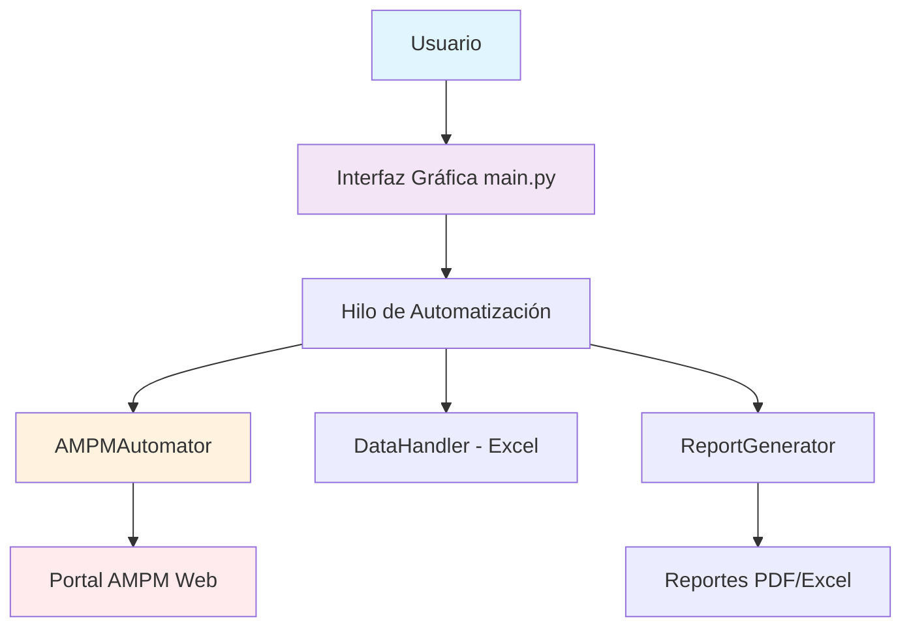

# AMPMAuto

Sistema de automatización para Grupo AMPM

## Desarrollado por
**Kevin Brian Ibarra Pineda**  
**ISIC**

## Características
- Automatización de guías de envío
- Interfaz gráfica intuitiva
- Reportes detallados
- Manejo robusto de errores


# **📚 TUTORIAL COMPLETO Y DOCUMENTACIÓN PARA AMPMAuto**

## **🎯 TUTORIAL GUIADO PASO A PASO**

### **PASO 1: INSTALACIÓN E CONFIGURACIÓN INICIAL**

#### **1.1 Descargar e Instalar Python**
```bash
# Verificar si Python está instalado
python --version
# Debe mostrar: Python 3.8 o superior
```

#### **1.2 Clonar/Descargar el Proyecto**
```bash
# Crear carpeta del proyecto
mkdir AMPMAuto
cd AMPMAuto
```

#### **1.3 Instalar Dependencias**
```bash
# Opción A: Instalar desde requirements.txt
pip install -r requirements.txt

# Opción B: Instalar manualmente
pip install PyQt5 selenium pandas openpyxl python-dotenv reportlab
```

#### **1.4 Configurar Archivo .env**
```env
# Credenciales REALES de AMPM
AMPM_USERNAME=tu_usuario_real
AMPM_PASSWORD=tu_contraseña_real
AMPM_URL=https://tpak.grupoampm.com/Convenio/Login?returnUrl=/

# Configuración de la aplicación
HEADLESS_MODE=False    # True para modo invisible
TIMEOUT=30
MAX_RETRIES=3
```

### **PASO 2: PREPARAR ARCHIVO EXCEL**

#### **2.1 Estructura Obligatoria del Excel**
```python
# guias_ejemplo.xlsx debe tener estas columnas:
"""
numero_guia | destinatario | direccion | peso | contenido | telefono
----------- | ------------ | --------- | ---- | --------- | --------
123456789   | Juan Pérez   | Calle 123 | 1.5  | Documentos| 5551234567
987654321   | María García | Av. 456   | 2.0  | Ropa      | 5557654321
"""
```

#### **2.2 Crear Excel de Prueba**
```python
# Ejecutar este script para crear archivo de prueba
python crea_excel_prueba.py
```

### **PASO 3: PRIMERA EJECUCIÓN**

#### **3.1 Probar Conexión con AMPM**
```bash
# Probar solo la automatización (modo visible)
python automator.py
```

**Lo que debes ver:**
- ✅ Chrome se abre automáticamente
- ✅ Inicia sesión en AMPM
- ✅ Navega a "Capturar Confirmaciones"
- ✅ Intenta procesar una guía de prueba

#### **3.2 Ejecutar Aplicación Completa**
```bash
# Ejecutar la aplicación completa
python main.py
```

### **PASO 4: USO NORMAL DE LA APLICACIÓN**

#### **4.1 Interfaz Gráfica - Flujo de Trabajo:**
1. **Seleccionar Archivo** → Clic en "📁 Seleccionar Excel"
2. **Verificar Datos** → Revisa que se muestre tu archivo
3. **Iniciar Proceso** → Clic en "🚀 Iniciar Automatización"
4. **Monitorear Progreso** → Observa logs y barra de progreso
5. **Revisar Resultados** → Ver reportes generados

#### **4.2 Pantallas de la Aplicación:**
```
┌─────────────────────────────────────────────────────────┐
│                AMPMAuto v1.0                            │
├─────────────────────────────────────────────────────────┤
│ 🚀 AUTOMATIZACIÓN          ⚙️ CONFIGURACIÓN            │
│                                                         │
│ 1. 📁 Seleccionar Archivo Excel                        │
│    [guias_octubre.xlsx]       [Seleccionar]            │
│                                                         │
│ 2. 📊 Progreso de Ejecución                           │
│    [====================] 75%                          │
│    Procesando guía 15 de 20...                         │
│                                                         │
│ 3. 🎯 Controles                                        │
│    [🚀 Iniciar] [⏹️ Detener] [📊 Generar Reporte]     │
└─────────────────────────────────────────────────────────┘
```

### **PASO 5: ANÁLISIS DE RESULTADOS**

#### **5.1 Reportes Generados Automáticamente**
```bash
# Los reportes se guardan en:
/reports/reporte_ampm_20241019_143022.pdf
/reports/reporte_ampm_20241019_143022.xlsx
```

#### **5.2 Estructura de Carpetas Final**
```
AMPMAuto/
├── 📄 main.py                 # Aplicación principal
├── 🔧 automator.py            # Robot de AMPM
├── 📊 data_handler.py         # Lector de Excel
├── 📋 report_generator.py     # Generador de reportes
├── ⚙️ utils/
│   ├── config.py              # Configuración
│   └── logger.py              # Sistema de logs
├── 📁 reports/                # Reportes PDF/Excel
├── 📁 logs/                   # Logs de ejecución
├── 🔐 .env                    # Credenciales
└── 📦 requirements.txt        # Dependencias
```

## **📖 DOCUMENTACIÓN TÉCNICA COMPLETA**

### **🏗️ ARQUITECTURA DEL SISTEMA**



### **🔧 MÓDULOS PRINCIPALES**

#### **main.py - Cerebro de la Aplicación**
```python
# Responsabilidades:
# ✅ Interfaz gráfica con PyQt5
# ✅ Gestión de hilos separados
# ✅ Comunicación en tiempo real
# ✅ Coordinación de procesos
# ✅ Generación de reportes
```

#### **automator.py - Robot de AMPM**
```python
# Tecnologías: Selenium WebDriver + Chrome
# Funciones:
# 🔐 Login automático en AMPM
# 🧭 Navegación inteligente
# 📝 Llenado de formularios
# ⚠️ Manejo de errores
# 🕒 Esperas inteligentes
```

#### **data_handler.py - Procesador de Excel**
```python
# Tecnología: Pandas
# Funciones:
# 📊 Lectura de archivos Excel
# ✅ Validación de datos
# 🔄 Transformación de formatos
# 📋 Estructuración de datos
```

#### **report_generator.py - Generador de Reportes**
```python
# Tecnologías: ReportLab + Pandas
# Formatos soportados:
# 📄 PDF - Para presentaciones
# 📊 Excel - Para análisis de datos
# 📈 Gráficos - Para visualización
```

### **⚙️ CONFIGURACIÓN AVANZADA**

#### **Variables de Entorno (.env)**
```env
# SEGURIDAD
AMPM_USERNAME=tu_usuario
AMPM_PASSWORD=tu_contraseña

# RENDIMIENTO
HEADLESS_MODE=True          # False para desarrollo
TIMEOUT=30                  # Segundos de espera
MAX_RETRIES=3               # Reintentos por error

# REPORTES
GENERATE_PDF_REPORTS=True
GENERATE_EXCEL_REPORTS=True
```

#### **Personalización de Selectores**
```python
# En automator.py - Actualizar si AMPM cambia su interfaz
SELECTORS = {
    'login_usuario': '#UserName',
    'login_password': '#Contrasenia', 
    'campo_guia': '#GuiaId',
    'boton_entregar': '#btnEntregar'
}
```

### **🚀 GUÍA DE SOLUCIÓN DE PROBLEMAS**

#### **Error: "ChromeDriver no encontrado"**
```bash
# Solución: Descargar ChromeDriver compatible
# 1. Ver versión de Chrome: chrome://version/
# 2. Descargar: https://chromedriver.chromium.org/
# 3. Agregar al PATH o misma carpeta del proyecto
```

#### **Error: "Login fallido"**
```bash
# Verificar:
# 1. Credenciales en .env son correctas
# 2. Conexión a internet estable
# 3. Portal AMPM no en mantenimiento
# 4. HEADLESS_MODE=False para ver qué pasa
```

#### **Error: "Excel no encontrado"**
```bash
# Verificar:
# 1. Archivo existe y tiene extensión .xlsx
# 2. Columnas requeridas están presentes
# 3. No está abierto en otro programa
```

### **🎯 MEJORES PRÁCTICAS**

#### **Para Uso Diario:**
1. **Preparar Excel** la noche anterior
2. **Ejecutar temprano** cuando AMPM tenga mejor rendimiento
3. **Revisar logs** para detectar patrones de error
4. **Guardar reportes** para auditoría

#### **Para Mantenimiento:**
1. **Backup de .env** con credenciales
2. **Actualizar dependencias** mensualmente
3. **Verificar cambios** en portal AMPM
4. **Monitorear uso de memoria**

### **🔮 ROADMAP Y MEJORAS FUTURAS**

#### **Versión 2.0 Planeada:**
- [ ] **Base de datos** integrada
- [ ] **Múltiples transportistas** (DHL, FedEx, Estafeta)
- [ ] **API REST** para integraciones
- [ ] **Dashboard web** con métricas
- [ ] **Notificaciones** por email/Telegram

#### **Versión 1.1 (Próxima):**
- [ ] **Validación avanzada** de guías
- [ ] **Reintentos inteligentes**
- [ ] **Métricas de rendimiento**
- [ ] **Plantillas de reportes** personalizables

## **📋 CHECKLIST DE IMPLEMENTACIÓN**

### **✅ PRE-REQUISITOS**
- [ ] Python 3.8+ instalado
- [ ] Chrome/Chromium instalado
- [ ] Acceso a portal AMPM verificado
- [ ] Excel con datos de prueba

### **✅ INSTALACIÓN**
- [ ] Dependencias instaladas
- [ ] Archivo .env configurado
- [ ] Estructura de carpetas creada

### **✅ PRUEBAS**
- [ ] Conexión AMPM exitosa
- [ ] Lectura de Excel funcional
- [ ] Interfaz gráfica responsive
- [ ] Reportes generados correctamente

### **✅ PRODUCCIÓN**
- [ ] Credenciales reales configuradas
- [ ] Excel de producción preparado
- [ ] Team entrenado en uso
- [ ] Procedimientos de respaldo establecidos

## **🎊 ¡FELICITACIONES!**

**Has implementado exitosamente AMPMAuto 🚀**

Tu aplicación ahora:
- ✅ **Reduce tiempo** de carga de horas a minutos
- ✅ **Elimina errores** humanos de tipeo
- ✅ **Genera reportes** automáticos profesionales
- ✅ **Es escalable** para crecer con tu negocio

**¿Listo para revolucionar tu proceso logístico?** 🎯